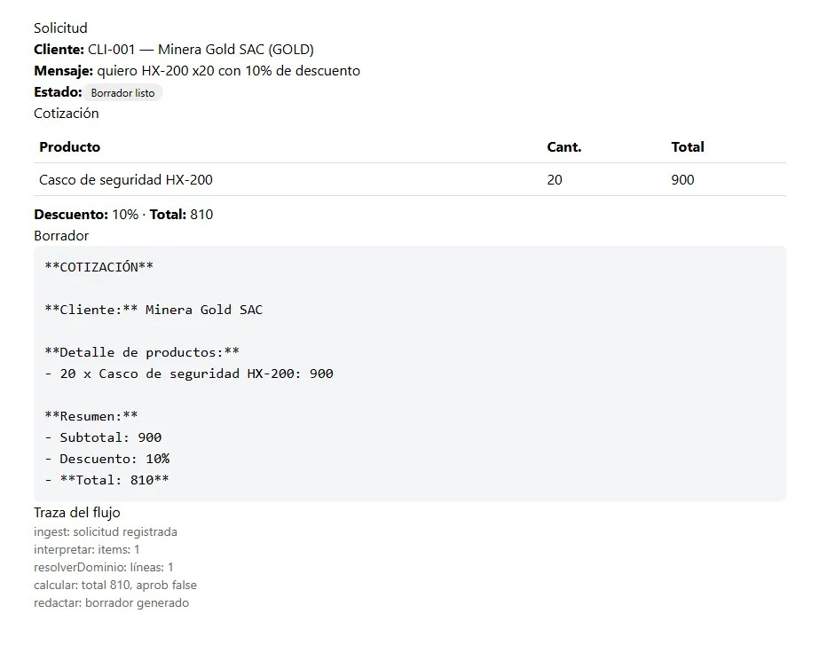
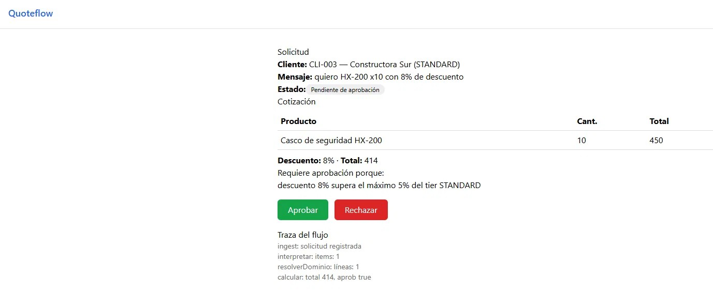

# QuoteFlow

Asistente **full-stack agentic** que prepara borradores de cotización B2B para la empresa
XYZ.sac, con **humano en el bucle**. A partir de una solicitud en texto libre, el sistema
interpreta el pedido, consulta el dominio, calcula de forma determinista, se detiene para
aprobación cuando corresponde, y genera un borrador **sin enviar nada al cliente y sin
inventar datos**.

## Qué hace

Una solicitud entra y el sistema la enruta a uno de cinco resultados:

- **Borrador listo** — camino feliz: cotización preparada para revisión.
- **Necesita aclaración** — falta información esencial.
- **Detenida** — producto desconocido o sin stock (no promete lo imposible).
- **Pendiente de aprobación** — monto > umbral o descuento fuera de política → espera a un humano.
- **Escalada** — cliente desconocido → revisión.

Principio central: **la IA solo interpreta y redacta; los números y las decisiones son
100% deterministas y auditables.**

## Arquitectura (4 capas)

1. **Dominio determinista** — productos (precio/stock), clientes, descuentos. Funciones puras.
2. **Grafo LangGraph** — orquesta el flujo con estado, pausa (`interrupt`) para aprobación
   humana y **reanudación durable** (checkpointer en PostgreSQL).
3. **IA (Gemini)** — interpretación con salida estructurada y redacción, tras interfaces
   inyectables con *fallback* determinista.
4. **Frontend Angular** — bandeja, detalle, aprobar/rechazar, crear solicitud.

Detalle en [`docs/ARCHITECTURE.md`](docs/ARCHITECTURE.md).

## Stack

Express · LangGraph · PostgreSQL · Prisma · Gemini · Angular · TypeScript

## Estructura del repositorio

```
quoteflow/
├── docs/                 # documentación del reto
├── quoteflowBackend/     # API + grafo + dominio + IA
└── quoteflow-frontend/   # aplicación Angular
```

## Cómo correr

Requisitos: Node.js 20+, PostgreSQL, una API key de Gemini.

**Backend:**
```bash
cd quoteflowBackend
npm install
cp .env.example .env        # configura DATABASE_URL y GOOGLE_API_KEY
npm run setup               # crea tablas + datos de ejemplo
npm run dev                 # API en http://localhost:3000
```

**Frontend:**
```bash
cd quoteflow-frontend
npm install
ng serve                    # app en http://localhost:4200
```
## Los dos caminos

**Camino feliz** : el descuento está dentro de la política del tier,
el flujo llega hasta el borrador sin detenerse.



**Requiere aprobación** : el descuento excede el máximo del tier.
El grafo se detiene y espera decisión humana, mostrando el motivo:
"descuento 8% supera el máximo 5% del tier STANDARD".



## Documentación

- [`docs/BUSINESS_CASE.md`](docs/BUSINESS_CASE.md) — caso de negocio.
- [`docs/REQUIREMENTS.md`](docs/REQUIREMENTS.md) — casos de uso y criterios de aceptación.
- [`docs/ARCHITECTURE.md`](docs/ARCHITECTURE.md) — arquitectura y decisiones.
- [`docs/ADR-001-politica-descuentos.md`](docs/ADR-001-politica-descuentos.md) — decisión de diseño.
- [`docs/AI_USE.md`](docs/AI_USE.md) — uso de IA en el desarrollo.
- [`docs/STATE.md`](docs/STATE.md) — estado, deuda técnica y próximos pasos.
